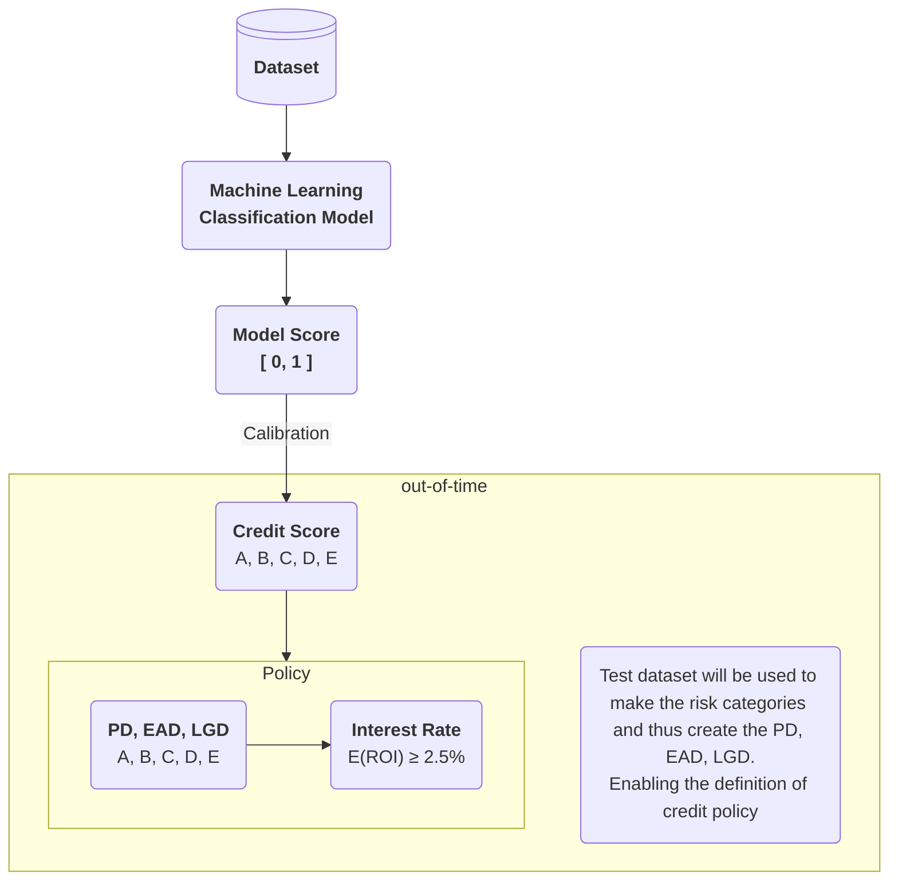

# Pratical credit policies with an ML model


Lending Club is a P2P company, which enables borrowers to obtain loans directly from individual and institutional investors

<br> <br>

## About dataset
[Lending Club 2007-2020Q3](https://www.kaggle.com/datasets/marcusos/lending-club-clean?select=lending_club_smaller_sample.feather)

- Borrower information: such as credit score, financial history, employment history…
- Details about the loan including loan amount, interest rate and loan status
- Response Variable:

| default | not default |
|--|--|
| 1 | 0 |

<br>

## Business problem

<br>

>Objective
- Objective of creating a credit policy with an **annualized ROI of at least 2.5%** (spread in relation to the basic interest rate)


<br>

>Problem
- What is the **minimum interest rate necessary** for a loan application to have an expected annualized **ROI of at least 2.5%**?

<br>

>Credit Policy
- According to the applicant's credit risk, set the interest on the loan so that it has at least an annual return of 2.5%

<br>

## How to calculate **return (ROI)** of a loan

```python
loan_amount = 100000                                    # Total loan amount
interest_rate = 0.15                                    # Interest rate applied to the loan
principal = (loan_amount * interest_rate) + loan_amount # Total amount to be paid for the loan W/ taxes
gains = principal - loan_amount                         # Profit earned from interest
term = 36                                               # Number of loan installments
installment = principal / term                          # Value of each installment
received = (term - 1) * installment                     # Total amount received so far
losses = principal - received                           # Difference between expected and actual profit
operating_costs = 100                                   # Fixed operating costs
```

<br>

$$
\Huge ROI = \frac{\text{Gains} - \text{Losses} - \text{Operating Costs}}{\text{Loan Amount}}
$$

```python
roi = (gains - losses - operating_costs) / loan_amount
print(f"ROI: {roi * 100 :.2f}%")
```
ROI: 11.71%

<br>

$$
\Huge Annualized = \frac{\text{ROI}}{\text{qty of years of operation}}
$$

```python
annualized = (roi / term) * 12
print(f"ROI annualized: {annualized *100 :.2f}%")
```
ROI Annualized: 3.90%

<br>

## ROI and expected loss from a loan application

```python
credit_scoring = "B"                    # Customer risk profile classification

pd = 0.14                               # Probability of default for class "B" customers
ead = 0.2                               # Exposure at default
lgd = 0.87                              # Loss given default

e_losses = (principal * pd * ead * lgd) # Expected loss
```

<br>

$$
\Huge E(ROI) = \frac{\text{Gains} - \text{(Principal * PD * EAD * LGD)} - \text{Operating Costs}}{\text{Loan Amount}}
$$

```python
e_roi = (gains - e_losses - operating_costs) / loan_amount
print(f"expected ROI: {e_roi * 100 :.2f}%")
```
expected ROI: 12.10%

<br>

## How to use credit-scoring to compute expected ROI

<br>

## Methodology



<br>

## Hands-on W/ python!
